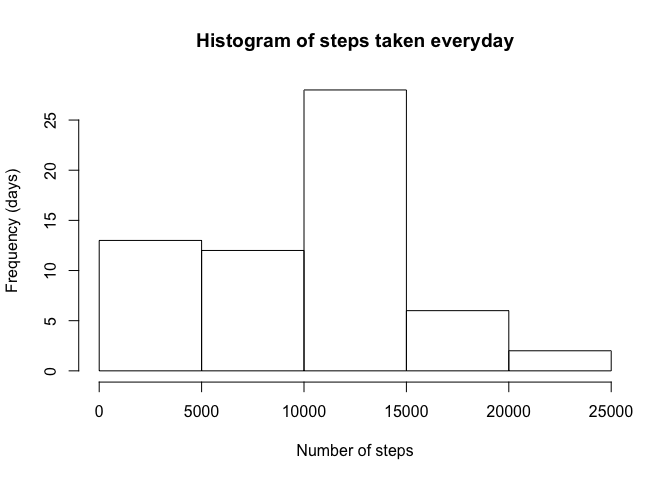
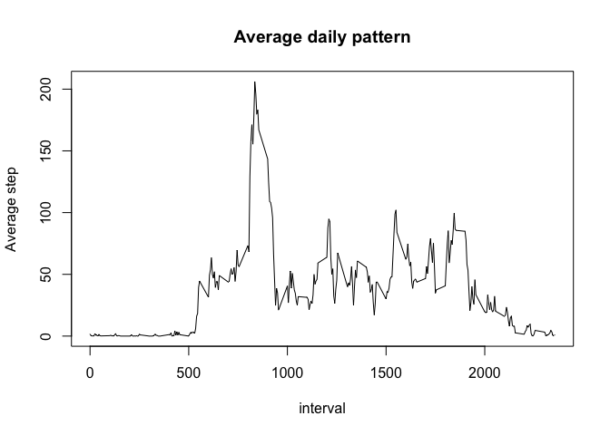
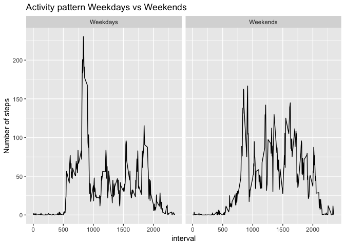

## Loading and preprocessing the data


```r
      unzip("activity.zip")
      data <- read.csv("activity.csv")
      data$date <- as.Date(as.character(data$date, "%Y-%m-%d"))
```

## What is mean total number of steps taken per day?


```r
      require(dplyr)
      df <- data %>% group_by(date) %>% summarise(total = sum(steps, na.rm=T))
      total <- sum(df$total)
      with(df, hist(total, main = "Histogram of steps taken everyday", xlab = "Number of steps", ylab = "Frequency (days)"))
```

<!-- -->

```r
      meanstep <- summary(df$total)
```
The mean and the median total number of step taken per day is **9354** and **10395** , respectively

## What is the average daily activity pattern?


```r
      require(dplyr)
      df <- data %>% group_by(interval) %>% summarise(mean = mean(steps, na.rm=T))
      with(df, plot(interval, mean, type = "l", ylab = "Average step", main = "Average daily pattern"))
```

<!-- -->

The interval **835** contains the maximum number of steps

## Imputing missing values


```r
      require(dplyr)
      missing <- sum(is.na(data))
      
      # Impute the NAs by the mean of that corresponding interval
      # User function for apply
       myfunc <- function(x){
            if(is.na(x[1])) {
                  x[1] <-  mean(data$steps[data$interval == as.numeric(x[3])], na.rm = T) 
            }
            else {x[1] <- as.numeric(x[1])}
       }
      NArep <- apply(data,1,function(x) myfunc(x))
      # Create new dataset with NA replaced
      newdata <- cbind(steps = NArep, data[,2:3])
     
      newdf <- newdata %>% group_by(date) %>% summarise(total = sum(steps, na.rm=T))
      with(newdf, hist(total, main = "Histogram of steps taken everyday with NA imputed", xlab = "Number of steps"))
```

<!-- -->

```r
      newmeanstep <- summary(newdf$total)
      
      # Compare the changes
      dmean <- abs(newmeanstep[4] - meanstep[4])/meanstep[4]*100
      dmedian <- abs(newmeanstep[3] - meanstep[3])/meanstep[3]*100
      newtotal <- sum(newdf$total)
      dtotal <- abs(newtotal - total)/total *100
```

The number of missing values is **2304**   
The histogram is changed significantly after NAs have been imputed, especially the relative magnitude between 0-5000 and 5000-10000 steps blocks.  
After NAs have been imputed, the mean and the median total number of step taken per day is **10766** and **10766** , respectively.  
The difference between imputing and ignore NAs are **15** % in mean and **4** % in median.  
The imputing of NAs make **15** % change in the total number of steps.  

## Are there differences in activity patterns between weekdays and weekends?

```r
      require(dplyr)
      require(ggplot2)
      newdata$date = weekdays(newdata$date)
      newdata = mutate(newdata, weekday = factor(1*(date == "Saturday" | date == "Sunday"), labels = c("Weekdays", "Weekends")))
      
      df <- newdata %>% group_by(weekday, interval) %>% summarise(mean = mean(steps))
      ggplot(df, aes(interval, mean)) + geom_line() + facet_grid(.~weekday) + ylab("Number of steps") + labs(title = "Activity pattern Weekdays vs Weekends")
```

<!-- -->

